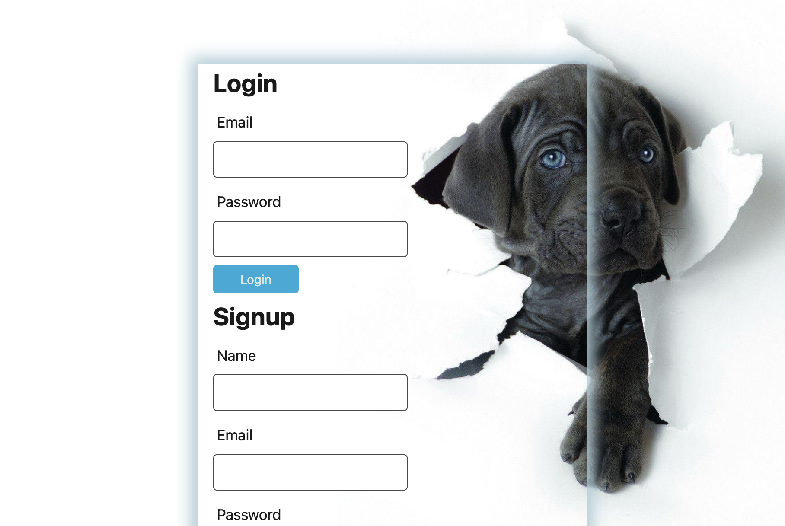
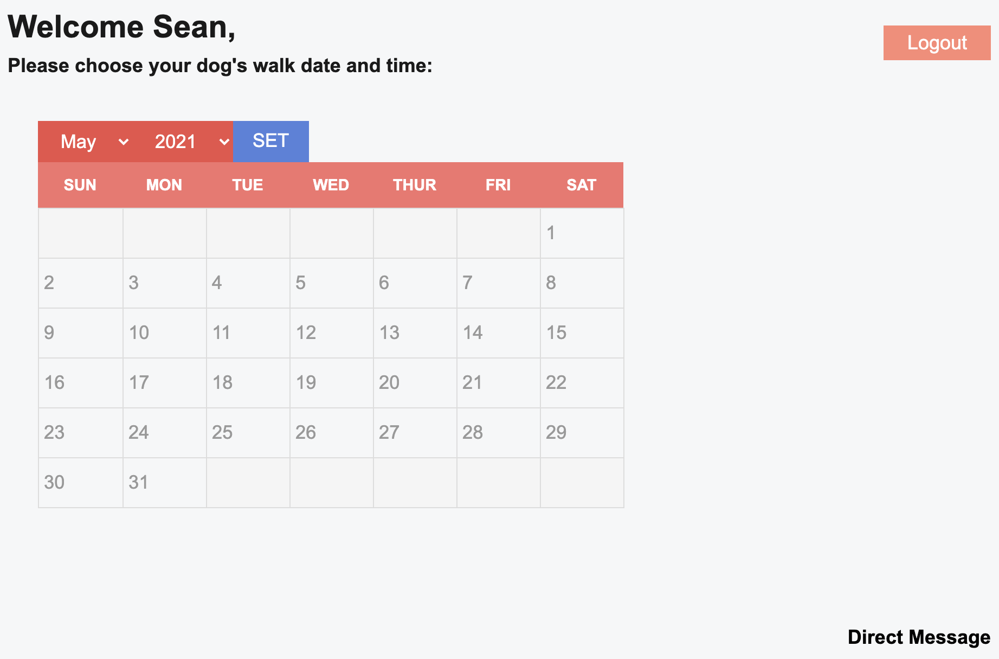
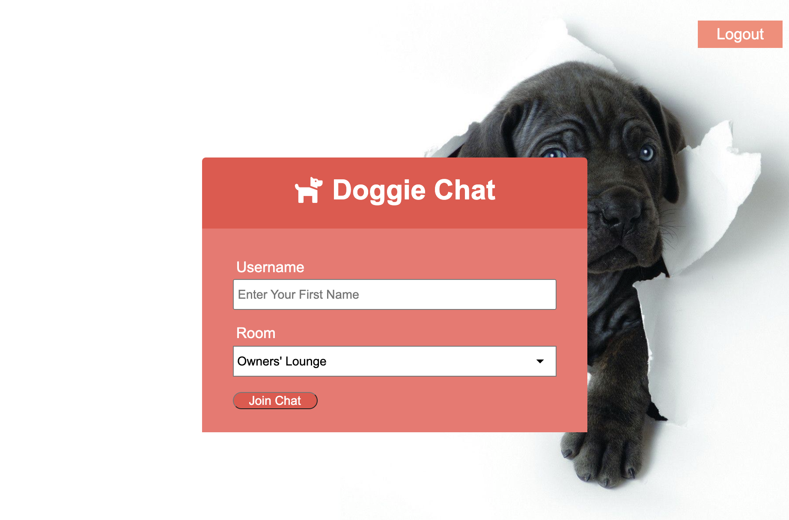
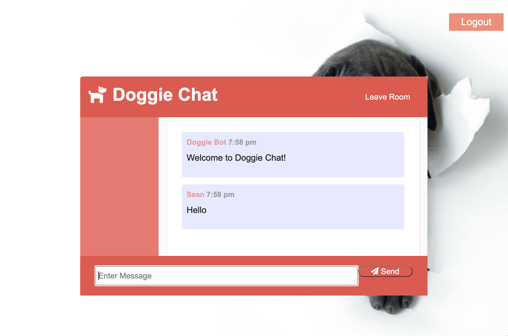

# Dog Walker Application

## Table of Contents

* Description
* Installation
* Usage
* Contributions
* Licensing
* Tests
* Demo
* Questions

## Description

With this application, dog owners can schedule their dogs for walks when convenient, leave reviews, and directly message dog walkers and other owners in a live messaging forum.

## Installation

The application repository can be cloned locally, or users can visit the deployed application at:

## Usage

The application can be used to make life more convenient for dog owners who rely on walkers to care for their dog's needs as they go about their daily routines and responsibilities. Now dog owners have direct access to itineraries and dog walkers whom care for their pets.

## Contributions

Paramaters to contributors include coordinated approval when pushing for a local branch. Code must pass review before being merged with primary code.

## Licensing

## Tests

Users can test back end code in Terminal by running 'npm start' in the command line.

## Demo

Deployed Heroku application: https://dogwalkerapp.herokuapp.com/

## Questions

* You can follow my repositories at https://www.github.com/jarretebarnett
* For professional inquiries, you can email jarretebarnett@gmail.com